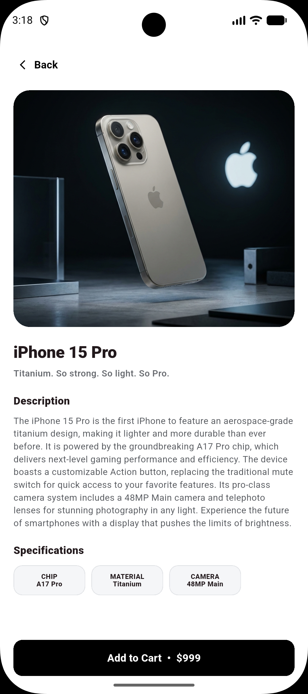
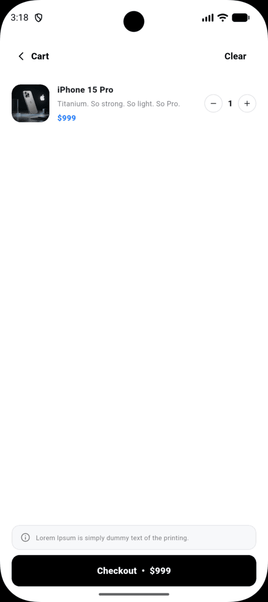
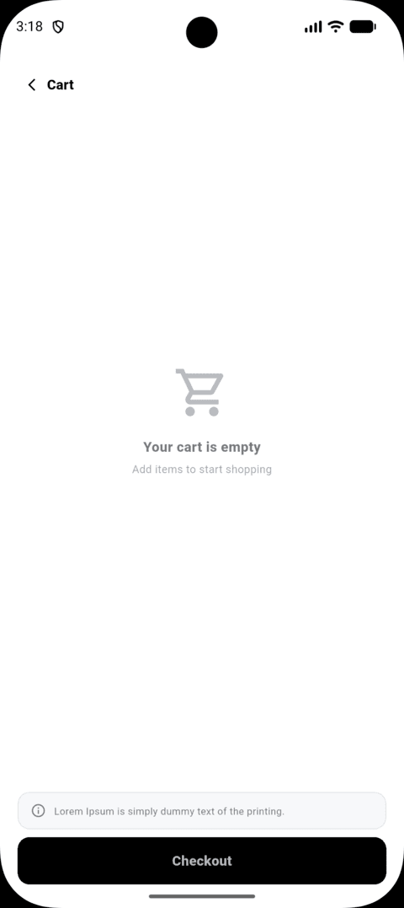

# Mini Katalog Uygulaması

Bu proje, Flutter günlük eğitim süreci kapsamında hazırlanmış temel seviyede bir mobil katalog uygulamasıdır. Projenin amacı; Flutter widget yapısı, sayfa geçişleri, veri modeli oluşturma, API üzerinden veri çekme, listeleme, detay ekranı oluşturma ve basit sepet mantığını uygulamalı olarak göstermektir.

## Proje Hakkında

Mini Katalog Uygulaması, ürünlerin internet üzerinden çekildiği ve kullanıcıya kart tabanlı bir arayüzle gösterildiği örnek bir Flutter projesidir. Kullanıcı ana sayfada banner görselini görüntüleyebilir, ürünleri listeleyebilir, ürün detaylarını inceleyebilir ve ürünleri sepete ekleyebilir.

Bu proje eğitim ve demo amacıyla hazırlanmıştır. Gerçek bir e-ticaret altyapısı değildir.

## Kullanılan Teknolojiler

- Flutter
- Dart
- Material Design
- Android Emulator / Fiziksel Android Cihaz
- Visual Studio Code
- Android Studio

## Kullanılan Flutter Sürümü

Projeyi çalıştırmadan önce kendi Flutter sürümünüzü görmek için aşağıdaki komutu çalıştırabilirsiniz:

```bash
flutter --version
```

Bu proje Dart SDK 3.x uyumlu Flutter sürümleriyle çalışacak şekilde hazırlanmıştır.

Örnek:

```text
Flutter 3.41.9
Dart 3.9.0
```

## Kullanılan Veri Kaynakları

Projede ürün bilgileri ve banner görseli internet üzerinden alınmaktadır.

### Banner Görseli

```text
https://wantapi.com/assets/banner.png
```

### Ürün Bilgileri

```text
https://wantapi.com/products.php
```

Ürün verileri eğitim amacıyla kullanılan mock API üzerinden çekilmektedir.

## Proje Özellikleri

- Ana sayfa tasarımı
- API üzerinden ürün verisi çekme
- Banner görselini internetten gösterme
- Ürünleri GridView ile listeleme
- Ürün kartı tasarımı
- Ürün detay sayfası
- Sayfalar arası geçiş
- Sepete ürün ekleme simülasyonu
- Basit state yönetimi
- Temiz klasör yapısı
- Material Design kullanımı
- Ekstra Flutter paketi kullanmadan temel yapı ile geliştirme

## Proje Klasör Yapısı

```text
lib/
├── main.dart
├── models/
│   └── product.dart
├── services/
│   └── product_service.dart
├── pages/
│   ├── home_page.dart
│   ├── product_detail_page.dart
│   └── cart_page.dart
├── widgets/
│   ├── product_card.dart
│   └── banner_widget.dart
```

Not: Klasör yapısı proje içeriğine göre küçük farklılıklar gösterebilir.

## Kurulum ve Çalıştırma Adımları

### 1. Projeyi Bilgisayara İndirme

GitHub repository sayfasından projeyi indirin veya aşağıdaki komutla klonlayın:

```bash
git clone https://github.com/EgeGokbayir/shop_project.git
```

Ardından proje klasörüne girin:

```bash
cd shop_project
```

### 2. Flutter Paketlerini Yükleme

```bash
flutter pub get
```

### 3. Cihaz veya Emülatör Kontrolü

```bash
flutter devices
```

Bu komut ile bağlı cihaz veya açık Android Emulator listelenir.

### 4. Projeyi Çalıştırma

```bash
flutter run
```

### Ana Sayfa


### Ürün Detay Sayfası



### Dolu Sepet Sayfası



### Boş Sepet Sayfası



Repository örneği:

```text
https://github.com/EgeGokbayir/shop_project.git
```

## Not

Bu proje eğitim amacıyla hazırlanmıştır. Kullanılan API ve görseller gerçek bir ticari e-ticaret sistemini temsil etmez.
